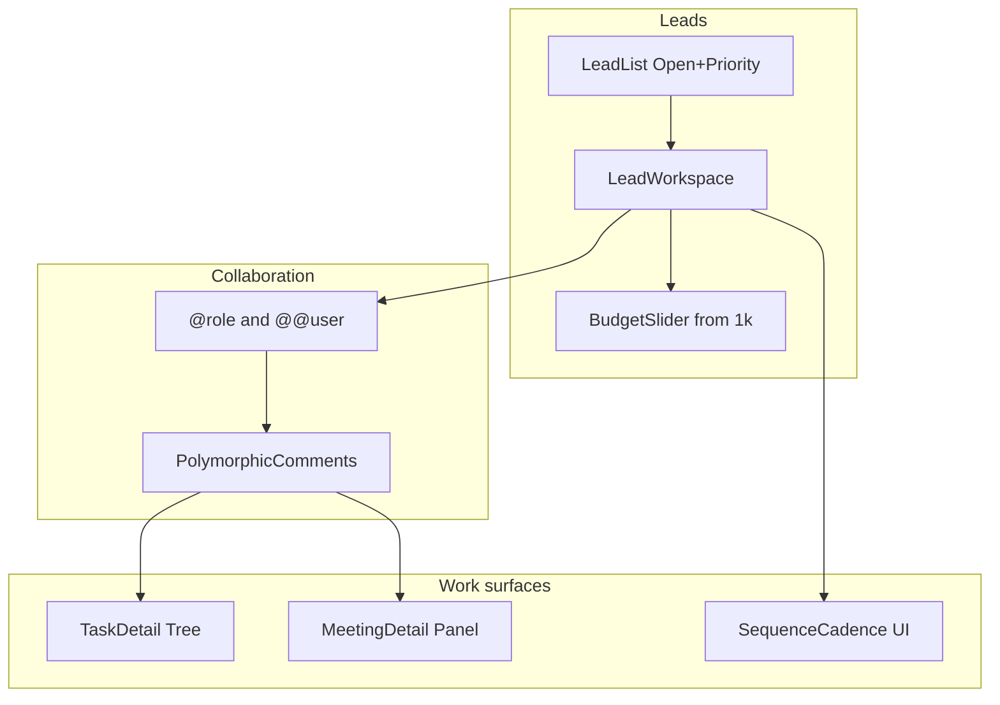

# CRM Leads, Tasks, Calendar & Sequences Overhaul

Assumptions locked for this plan: **full lead workspace** and **enrich Meetings** (not a separate task calendar). Reply if you want those changed.

---

## Current gaps (short)

| Area | Today | Target |
|------|--------|--------|
| Budget range | EAV `SELECT` (`<$10k` / `$10k–50k` / `$50k+`) in [`CustomFieldsPanel.tsx`](frontend/src/components/CustomFieldsPanel.tsx) | Continuous slider from **$1k** + priority control |
| Lead list | No link to detail; only Convert ([`leads/page.tsx`](frontend/src/app/(app)/leads/page.tsx)) | **Open** for SDR/Manager (and AE) → `/leads/[id]` |
| Refine | `Refine score (AI overlay)` on detail | **Removed** from UI (API can stay) |
| Lead detail | Thin fields + custom fields + timeline | Owner, priority, tasks, comments, sequence enroll, dupes |
| Mentions | `@username` only on deal comments ([`automation.py`](backend/apps/crm/automation.py)) | `@` → **role**, `@@` → **user**, with autocomplete |
| Tasks | Flat complete/reopen list ([`tasks/page.tsx`](frontend/src/app/(app)/tasks/page.tsx)); no detail/comments/tree | Clickable detail: creator, comments, subtask tree/status |
| Calendar | Week grid of meetings; no role/job/comments ([`calendar/page.tsx`](frontend/src/app/(app)/calendar/page.tsx)) | Job detail, target role, mentioned users, comment tree |
| Sequences | Working API + admin-ish page; confusing UX; docs claim tasks that don’t exist | Clear cadence UX; schema/UI aligned; enrollment lifecycle + tracking visible |

---

## Workstream 1 — Leads: budget, priority, open, remove refine, richer detail

### Schema / seed

- Add first-class [`Lead`](backend/apps/crm/models.py) fields:
  - `priority`: `low | medium | high | urgent` (default `medium`)
  - `budget_min_cents` or `budget_amount` (`PositiveIntegerField`, dollars, min **1000**, nullable) — prefer dollars `budget_amount` for simplicity with UI “$1k…”
- Migrate existing EAV `budget_range` select values into approximate amounts (e.g. `<$10k`→1000, `$10k–50k`→10000, `$50k+`→50000), then deactivate or remove the old `budget_range` definition in seed.
- Update [`seed_demo.py`](backend/apps/crm/management/commands/seed_demo.py): stop seeding select `budget_range`; ensure demo leads have `budget_amount` + `priority`.
- Serializer/filter: expose `priority`, `budget_amount`; allow `?priority=` and ordering.

### Frontend — list ([`leads/page.tsx`](frontend/src/app/(app)/leads/page.tsx))

- Make lead **name** a `Link` to `/leads/[id]`.
- Add explicit **Open** button (visible to SDR, Manager, AE — same route; role only gates merge/admin elsewhere).
- Show priority badge; optional quick priority filter chips.
- Keep Convert for eligible leads.

### Frontend — detail ([`leads/[id]/page.tsx`](frontend/src/app/(app)/leads/[id]/page.tsx))

- **Remove** “Refine score (AI overlay)” button and its handler (leave `POST …/ai-score-overlay/` for API/tests).
- **Budget bar**: range slider min `1000`, max e.g. `500000`, step `1000`, live `$Xk` label; PATCH `budget_amount`.
- **Priority** button group (4 levels) → PATCH.
- **More control** blocks:
  - Owner select (from `/api/auth/team/`, Manager can reassign; SDR/AE can only set self if policy already allows — match existing owner rules on create/routing).
  - Status/source/notes as today, plus explicit Save where blur-save is unclear.
  - Embedded **lead tasks** list + create (reuse Task API `?lead=`).
  - **Comments** panel (new LeadComment API — see Workstream 2).
  - **Sequence enroll** dropdown (list active sequences → enroll).
  - Wire **DuplicateSuspects** (already used on accounts) onto lead detail.
  - Keep Timeline + CustomFieldsPanel for remaining custom defs.

### Custom fields panel

- Special-case key `budget_amount` is **not** needed if first-class; keep panel for other defs only.
- Optional later: add `range` field_type — **out of scope**; use Lead field for budget.

---

## Workstream 2 — Mentions: `@` role, `@@` user

### Backend

- Replace single-regex mention fan-out in [`automation.py`](backend/apps/crm/automation.py):
  - `@@([a-zA-Z0-9_]+)` → match `User.username` (exact/iexact).
  - `(?<!@)@([A-Za-z]+)` → match roles `SDR|AE|MANAGER` (case-insensitive) → notify **all active users with that role** (exclude author).
- Parse order: resolve `@@user` first so `@AE` is not confused with usernames.
- Generalize notification helper to accept `(body, actor, link, entity_label)` so Lead/Task/Meeting comments reuse it (not only `DealComment`).

### Shared comment model approach

Prefer **one polymorphic comment** (cleaner than 4 near-copies):

- `Comment`: `author`, `body`, `parent` (nullable self-FK for thread), `content_type` + `object_id` **or** explicit nullable FKs: `opportunity`, `lead`, `task`, `meeting` (exactly one set). Prefer **explicit FKs** to stay consistent with this codebase’s style (no ContentType usage elsewhere in CRM).
- Migrate `DealComment` → new `Comment` with `opportunity_id` filled (data migration), then deprecate `DealComment`.
- Endpoints: nested under each parent (`/api/leads/{id}/comments/`, `/api/tasks/{id}/comments/`, `/api/meetings/{id}/comments/`, keep opportunities comments path).
- On create: run mention notifier.

### Frontend

- New reusable [`MentionTextarea.tsx`](frontend/src/components/MentionTextarea.tsx):
  - Typing `@` → role suggestion list (SDR / AE / Manager).
  - Typing `@@` → user suggestion list from `/api/auth/team/`.
  - Insert token into body; hint text documents the convention.
- Use on opportunity, lead, task detail, meeting detail.

---

## Workstream 3 — Tasks: clickable detail, creator, comments, tree

### Schema ([`Task`](backend/apps/crm/models.py))

- `created_by` FK (nullable for backfill; set on create).
- `parent` FK self, null=True → subtasks (“task tree”).
- `status`: `todo | in_progress | blocked | done` (map existing `completed` ↔ `done` for compatibility; keep `completed` bool synced in `save()` or drop after migration).
- Optional `priority` on tasks (align with lead priority enum) — include for list sorting.

### API

- Serializer exposes `created_by`, `parent`, `status`, `children` (or nested on detail retrieve).
- Filters: `parent`, `lead`, `opportunity`, `status`, existing `mine`/`overdue`.
- Detail retrieve returns children + comment count.
- Create from `/tasks` page (missing today).

### Frontend

- [`tasks/page.tsx`](frontend/src/app/(app)/tasks/page.tsx): rows **clickable** → open detail drawer or `/tasks/[id]`.
- Detail surface shows: title, description, status workflow, due, **creator**, owner, linked lead/deal, **comment tree** (`MentionTextarea`), **subtask tree** with status checkboxes.
- Create form: title, due, optional parent, lead/opportunity link.
- Opportunity-embedded task list: link into same detail.

---

## Workstream 4 — Calendar: job detail, role, mentioned users, comments

### Schema ([`Meeting`](backend/apps/crm/models.py))

- `job_detail` TextField (what the meeting/job is for).
- `target_role` CharField choices matching `User.Role` (SDR/AE/MANAGER), blank allowed.
- `mentioned_users` M2M to User (explicit assignees/watchers beyond host).
- Reuse shared `Comment` with `meeting` FK.

### API / permissions

- List filters: `target_role`, `host`, `mentioned` (meetings where current user is mentioned).
- Role views on serializer for managers (already see all); UI adds filters:
  - **My calendar** / **Role: SDR|AE|Manager** / **Mentioned me**.
- Fix week query: honor `starts_at` range in filterset (today client fetches then filters).

### Frontend ([`calendar/page.tsx`](frontend/src/app/(app)/calendar/page.tsx))

- Click meeting → **detail panel** (side sheet): title, time, host, invitee, **job detail**, **target role**, **mentioned users** (multi-select), status, notes, **comment tree**.
- In-app create/edit meeting form (not only public booking): host defaults to self; role + mentions required fields in UX copy.
- Visual badge on grid cells by `target_role`.

Public booking can leave `target_role`/mentions empty; host fills after.

---

## Workstream 5 — Sequences: schema check + usable product

### What sequences are (document in UI)

Email **cadence**: Template → Sequence (ordered steps with delay) → Enroll Lead → Celery advances due steps → sends `EmailMessage` → tracks open/click. They do **not** create CRM `Task` rows (fix misleading subtitle/docs).

### Schema hardening (minimal, high value)

Keep core models; add what’s missing for a clear skeleton:

- `SequenceStep.step_type`: `email` (default; room for `task` later without fake claims).
- `SequenceEnrollment.cancelled_at`, cancel reason optional.
- Ensure `EmailMessage.enrollment` + open/click already exist — **surface in API** on enrollment detail: nested recent messages with `open_count`/`click_count`.
- Unique `(sequence, lead)` already present — keep; on re-enroll require prior cancelled/completed.

Optional small addition: `Sequence.description` for UI explanation.

### Backend UX APIs

- Enrollment **cancel** action exposed and used by UI.
- Sequence detail includes ordered steps + enrollment counts.
- Manager “Advance due steps” remains; show last `JobRun` status clearly when Celery isn’t running.

### Frontend rewrite ([`sequences/page.tsx`](frontend/src/app/(app)/sequences/page.tsx))

Replace one-page dump with clear sections:

1. **What this is** one-sentence + “requires Celery worker/beat to send”.
2. **Templates** CRUD (edit/delete).
3. **Sequences** — pick one → step timeline (order, delay, template); add/reorder/remove step.
4. **Enrollments** — lead link, status, current step, next run, last message, **open/click** from related emails; **Cancel**.
5. Enroll from lead detail (Workstream 1) as primary SDR path; sequences page for managers/builders.

Update [`portofilowManagerWorkflow.md`](portofilowManagerWorkflow.md) / any LEARNING notes that say sequences create Tasks.

---

## Implementation order (phased delivery)

| Phase | Scope | Why first |
|-------|--------|-----------|
| **P0** | Lead Open link, remove Refine, Lead.priority + budget slider + seed/migration | Immediate asks, small blast radius |
| **P1** | Shared Comment + @role / @@user + MentionTextarea; wire lead + opportunity | Unblocks tasks/calendar comments |
| **P2** | Task tree/status/created_by + detail UI + create on /tasks | Core daily workflow |
| **P3** | Meeting job_detail/role/mentions + calendar detail panel + filters | Calendar “for roles” |
| **P4** | Sequence schema tweaks + UI rewrite + lead enroll | Fix broken mental model |
| **P5** | Lead workspace polish: owner, tasks embed, dupes, sequence enroll | Completes “more control” |

---

## Key files to touch

**Backend:** [`models.py`](backend/apps/crm/models.py), new migration `0010_…`, [`serializers.py`](backend/apps/crm/serializers.py), [`views.py`](backend/apps/crm/views.py), [`automation.py`](backend/apps/crm/automation.py), [`urls.py`](backend/apps/crm/urls.py), [`seed_demo.py`](backend/apps/crm/management/commands/seed_demo.py), tests under `backend/apps/crm/tests_*.py`.

**Frontend:** [`leads/page.tsx`](frontend/src/app/(app)/leads/page.tsx), [`leads/[id]/page.tsx`](frontend/src/app/(app)/leads/[id]/page.tsx), [`tasks/page.tsx`](frontend/src/app/(app)/tasks/page.tsx) (+ optional `tasks/[id]`), [`calendar/page.tsx`](frontend/src/app/(app)/calendar/page.tsx), [`sequences/page.tsx`](frontend/src/app/(app)/sequences/page.tsx), [`types.ts`](frontend/src/lib/types.ts), new `MentionTextarea.tsx`, opportunity comments swap to shared component.

---

## Out of scope (explicit)

- Google Calendar OAuth sync
- Real inbound email reply sync
- Sequence step type that auto-creates Tasks (can add later via `step_type=task`)
- Replacing score engine; only remove Refine UI
- New custom field type `range` (budget is first-class on Lead)
