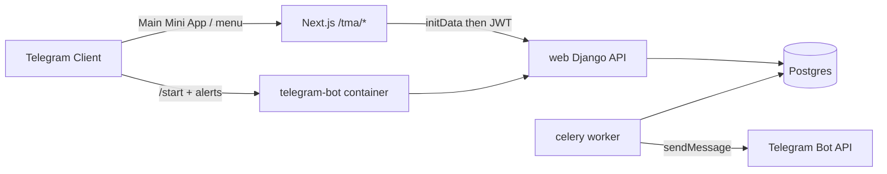

# Telegram Mini App Dashboard for PipelineHQ

## Decisions (locked)

- **Scope:** tracker + light writes (lead status, opportunity stage, meeting status)
- **Auth:** one-time PipelineHQ username/password link binds Telegram `user.id` → CRM `User`
- **Look:** reuse existing synthwave tokens/components ([`frontend/src/app/globals.css`](frontend/src/app/globals.css), [`frontend/src/components/ui.tsx`](frontend/src/components/ui.tsx)) — mobile-optimized shell, not a restyle
- **Stack fit:** Mini App in the existing Next.js app; bot + initData validation in Django (Python), matching the current backend
- **Runtime:** everything runs via **Docker Compose** (existing stack + new `telegram-bot` service). No “run the bot only on the host” path for the shipped setup.

## Architecture



**Data plane:** Mini App → existing `/api/leads/`, `/api/opportunities/`, `/api/meetings/`, `/api/accounts/`, `/api/contacts/`, `/api/dashboard/` after JWT is issued.

**Auth plane:** validate Telegram `initData` (HMAC-SHA256 per [official docs](https://core.telegram.org/bots/webapps#validating-data-received-via-the-mini-app)), then link or issue the same SimpleJWT tokens the web app uses.

## Official Mini App knowledge (build against these)

| Topic | Source |
|-------|--------|
| Mini Apps overview, launch modes, `Telegram.WebApp` | https://core.telegram.org/bots/webapps |
| `initData` HMAC validation | https://core.telegram.org/bots/webapps#validating-data-received-via-the-mini-app |
| Bot API (`WebAppInfo`, menu button, etc.) | https://core.telegram.org/bots/api |
| Official JS SDK | https://telegram.org/js/telegram-web-app.js |
| Community TS SDK / guides | https://docs.telegram-mini-apps.com |

Ship a short [`TELEGRAM.md`](TELEGRAM.md) in-repo with BotFather setup, Docker + HTTPS tunnel notes, env vars, and these links.

---

## Phases

### Phase 1 — Base configuration (Docker-first)

Goal: scaffold env, settings, Compose, empty Django app, and docs so later phases plug in cleanly. **No full auth UI or tracker screens yet.**

1. **Env & settings**
   - Add to [`.env.example`](.env.example) and Django settings (`backend/config/settings.py`):
     - `TELEGRAM_BOT_TOKEN`
     - `TELEGRAM_BOT_USERNAME`
     - `TELEGRAM_WEBAPP_URL` (public HTTPS URL of the Mini App, e.g. tunnel → frontend `/tma`)
     - Optional: `TELEGRAM_BOT_ENABLED=1` (bot container no-ops / exits cleanly if token missing)
   - Wire settings so missing token does not crash `web` / `worker` at import time (bot service can wait or skip)

2. **Docker Compose** ([`docker-compose.yml`](docker-compose.yml))
   - Pass Telegram env vars into `web`, `worker`, `beat`, and new `telegram-bot`
   - Extend `CORS_ALLOWED_ORIGINS` on `web` to include the public Mini App origin when set (document pattern; may use same host as frontend)
   - Add service **`telegram-bot`**:
     - Same build as backend (`Dockerfile.backend`)
     - Command: `python manage.py run_telegram_bot` (stub OK in Phase 1 that logs “not configured” or idle-loops until token present)
     - `depends_on: [web, redis, db]`
     - Volumes: `./backend:/app` like other backend services
     - Env: DB/Redis + `TELEGRAM_*` + `TELEGRAM_WEBAPP_URL`
   - Ensure `frontend` can receive `NEXT_PUBLIC_API_URL` / `NEXT_PUBLIC_TELEGRAM_BOT_USERNAME` if needed for deep links
   - Document that local Telegram testing needs an **HTTPS tunnel** (cloudflared/ngrok) to the frontend container (`:3000`) because Telegram Mini Apps require HTTPS

3. **Django app skeleton** `backend/apps/telegram/`
   - Create app, register in `INSTALLED_APPS`
   - Stub modules: `apps.py`, `urls.py` (empty or health ping), `validation.py` (placeholder or full HMAC helper), `views.py` (stubs), `management/commands/run_telegram_bot.py` (stub)
   - Mount under `/api/telegram/` in [`backend/config/urls.py`](backend/config/urls.py)
   - Add `python-telegram-bot` to [`requirements.txt`](requirements.txt) (rebuild backend image)

4. **User model prep**
   - Add `telegram_id = BigIntegerField(null=True, blank=True, unique=True)` on [`backend/apps/accounts/models.py`](backend/apps/accounts/models.py)
   - Migration included in Phase 1 so Compose `migrate` picks it up

5. **Docs**
   - Write [`TELEGRAM.md`](TELEGRAM.md): BotFather checklist, required env, `docker compose up`, tunnel → set Main Mini App + menu button URL to `https://<tunnel>/tma`, rebuild notes (`docker compose build web telegram-bot`)

**Phase 1 done when:** `docker compose up` brings stack + `telegram-bot` without errors; migration applied; `/api/telegram/` mounted; env documented; bot command runs (stub or real idle).

---

### Phase 2 — Backend auth + linking

- `validate_init_data(init_data, bot_token, max_age_seconds=86400)` — official HMAC algorithm, constant-time compare, reject stale `auth_date`
- Views:
  - `POST /api/telegram/auth/` — `{ init_data }` → JWT if linked, else `{ needs_link: true, telegram_user }`
  - `POST /api/telegram/link/` — `{ init_data, username, password }` → bind `telegram_id` → JWT
  - `POST /api/telegram/unlink/` — authenticated clear
- Unit + API tests
- Show `telegram_id` on admin / profile for debugging

### Phase 3 — Frontend Mini App (`/tma`)

Mobile-first routes (reuse `api`, types, synthwave UI; **do not** use desktop `AppShell`):

| Route | Purpose |
|-------|---------|
| `/tma` | Bootstrap: `telegram-web-app.js`, `ready()` + `expand()`, call `/api/telegram/auth/` |
| `/tma/link` | Synthwave login card → `/api/telegram/link/` |
| `/tma` home | Compact `/api/dashboard/` |
| `/tma/leads` + `/tma/leads/[id]` | List + detail; PATCH lead `status` |
| `/tma/pipeline` + `/tma/opportunities/[id]` | List/columns; PATCH `stage` |
| `/tma/schedule` + meeting detail | Upcoming; PATCH `completed` / `cancelled` |
| `/tma/clients` | Accounts/contacts glance |

Shared: `frontend/src/lib/telegram.ts`, `frontend/src/lib/tma-auth.tsx`, bottom tab bar, `start_param` deep links.

Frontend image rebuild after adding routes (`docker compose build frontend`).

### Phase 4 — Bot behavior + alerts

- Real `run_telegram_bot`: `/start`, set menu button to `TELEGRAM_WEBAPP_URL`
- Celery tasks (worker container): notify linked users on lead/opp/meeting status/stage change with `?startapp=lead_<id>` etc.
- Never expose bot token to the frontend

---

## Docker detail (canonical)

| Service | Role for Mini App |
|---------|-------------------|
| `db` / `redis` | Unchanged |
| `web` | API + initData auth/link; gets `TELEGRAM_*` for validation |
| `worker` / `beat` | Alerts via Bot API using `TELEGRAM_BOT_TOKEN` |
| `frontend` | Serves `/tma` Mini App (tunneled HTTPS in dev) |
| **`telegram-bot`** (new) | Long-polling/webhook bot process via `manage.py run_telegram_bot` |

Rebuild after dependency changes:

```bash
docker compose build web worker beat telegram-bot
docker compose up -d
```

Tunnel example (host) — one tunnel to frontend; `/api` is proxied to Django:

```bash
cloudflared tunnel --url http://127.0.0.1:3000
# Set TELEGRAM_WEBAPP_URL=https://<id>.trycloudflare.com/tma
# Leave NEXT_PUBLIC_API_URL empty (same-origin proxy)
# BotFather Main Mini App + menu button → same URL
```

---

## Out of scope (first ship)

- Full create/edit of leads/deals/meetings/clients
- Attachment menu / inline-mode Mini Apps
- Replacing the main website dashboard
- Theme toggle / abandoning synthwave for Telegram `colorScheme`
- Non-Docker primary workflow

## Verification

- Phase 1: Compose healthy; migration; telegram app importable; bot starts (idle or polling)
- Phase 2: validate_init_data tests; auth → needs_link → link → JWT
- Phase 3–4: tunnel + BotFather → link demo user → browse + PATCH → alert; meeting status PATCH works for visible AE/SDR meetings

## Implementation order (summary)

1. **Phase 1** — Docker env, Compose `telegram-bot`, Django app skeleton, `telegram_id` migration, `TELEGRAM.md`
2. **Phase 2** — initData HMAC + auth/link/unlink + tests
3. **Phase 3** — `/tma` UI (synthwave) + light PATCH actions
4. **Phase 4** — bot `/start` + menu button + Celery alerts

## Todos

- [x] **Phase 1:** Env, settings, Compose `telegram-bot`, `apps/telegram` skeleton, `telegram_id` migration, `TELEGRAM.md`
- [x] **Phase 2:** initData validator + `/api/telegram/auth|link|unlink` + tests
- [x] **Phase 3:** `/tma` Mini App shell (synthwave) with tracker tabs + light PATCH actions
- [x] **Phase 4:** Real bot worker + Celery status/stage alerts with `startapp` deep links
