# PipelineHQ Additions Roadmap

Portfolio + usable sales CRM workflow plan. Goal: **Both** — high-impact sales workflows that also read as strong portfolio engineering.

Scope covers all of: real email, timeline/calendar, CPQ-lite, scoring/health, duplicates + account UX, custom fields/territories/audit, AI assists, and realtime push.

**Status:** Phase 5 complete (AI assists + Channels realtime); roadmap shipped.

---

## Gap map (successful CRMs vs us)

| Capability | HubSpot / SF / Pipedrive | PipelineHQ today |
| --- | --- | --- |
| Lead→deal pipeline, tasks, forecast | Yes | **Have** (incl. MEDDIC) |
| Sequences / templates | Yes | **Have** (Celery send + EmailMessage; console/SMTP via env) |
| Real email send + open/click tracking | Yes | **Have** |
| Email/calendar sync + meeting booking | Yes | **Have** (CRM-native booking; no Google OAuth) |
| Unified activity timeline | Yes | **Have** |
| Products & quotes | Yes (CPQ / Smart Docs) | **Have** (CPQ-lite; no PriceBook) |
| Lead scoring / deal health | Yes (AI + rules) | **Have** |
| Duplicate detection | Yes | **Have** |
| Full account/contact UX | Yes | **Have** |
| Custom fields | Yes | **Have** |
| Territories | Yes (esp. Salesforce) | **Have** |
| Audit log | Yes (enterprise) | **Have** |
| AI assists | Yes (Einstein / Breeze / Pipedrive AI) | **Have** |
| Realtime notifications/jobs | Common | **Have** (Channels + HTTP fallback) |

Existing foundation to leverage:

- [`backend/apps/crm/models.py`](backend/apps/crm/models.py)
- Celery tasks in [`backend/apps/crm/tasks.py`](backend/apps/crm/tasks.py)
- Deal detail at [`frontend/src/app/(app)/opportunities/[id]/page.tsx`](frontend/src/app/(app)/opportunities/[id]/page.tsx)
- Thin accounts UI
- Sequence / email-template models already present

```mermaid
flowchart LR
  subgraph phase1 [Phase1 Records]
    AccountsUX[AccountsContactsUX]
    Timeline[UnifiedTimeline]
    Dupes[DuplicateDetection]
  end
  subgraph phase2 [Phase2 Comms]
    Email[RealEmailSend]
    Track[OpenClickTracking]
    Calendar[CalendarMeetings]
  end
  subgraph phase3 [Phase3 Revenue]
    Products[ProductCatalog]
    Quotes[QuotesCPQLite]
    Score[LeadScoreDealHealth]
  end
  subgraph phase4 [Phase4 Platform]
    Custom[CustomFields]
    Terr[Territories]
    Audit[AuditLog]
  end
  subgraph phase5 [Phase5 Intelligence]
    AI[AIAssists]
    WS[RealtimePush]
  end
  phase1 --> phase2 --> phase3 --> phase4 --> phase5
```

---

## Phase 1 — Record depth (Accounts, timeline, duplicates)

**Why first:** Successful CRMs treat Account/Contact as the system of record. Our API exists; UI and relationship views do not.

### Add

1. **Account & Contact UX**
   - Detail routes: `/accounts/[id]`, `/contacts/[id]` (and optionally `/leads/[id]`).
   - Create/edit forms; related contacts, opportunities, tasks on account.
   - Search hits deep-link to detail pages (LEARNING §6).

2. **Unified activity timeline**
   - Chronological feed on Account / Contact / Opportunity / Lead: activities, tasks completed, stage changes, comments, sequence steps, later emails/meetings.
   - New `TimelineEvent` projection (or query union) rather than only `Activity` on opportunities.

3. **Duplicate detection**
   - On Lead/Contact create+import: match email / domain / name+company.
   - API returns suspects; UI offers merge or “create anyway”.
   - Manager merge action (keep winner, re-point FKs).

**Done when:** Reps can open an account, see full history, create contacts, and catch obvious dupes before convert.

---

## Phase 2 — Communication (real email + calendar)

**Why next:** Without email, sequences remain fake; this is the #1 gap vs Pipedrive/HubSpot.

### Add

1. **Real outbound email**
   - Swap console backend for SMTP/SendGrid (env-configured).
   - Sequence advance and “Send email” actually deliver via Celery.
   - Persist `EmailMessage` (to, subject, body, related lead/contact/opp, status).

2. **Tracking**
   - Tracking pixel + link redirects → open/click events.
   - Notifications: “Prospect opened / clicked”.
   - Timeline entries for send/open/click/reply (reply can start as manual log if inbound sync is later).

3. **Calendar & meeting booking (CRM-native first)**
   - `Meeting` model + availability slots per user (no Google OAuth required for v1).
   - Public booking link creates Meeting + Activity + optional Task.
   - Calendar week view for “my meetings”.
   - Later optional: Google Calendar sync as Phase 2b.

**Done when:** Demo sequence sends real mail (or Mailtrap), tracking shows on deal timeline, prospect can book a meeting.

---

## Phase 3 — Revenue intelligence (products, quotes, scoring)

**Why next:** Closes the path from qualified deal → commercial proposal; scoring prioritizes work like modern CRMs.

### Add

1. **Products & quotes (CPQ-lite)**
   - Models: `Product`, `PriceBook` (optional v1: single price), `Quote`, `QuoteLineItem`.
   - Opportunity → create quote → line items, discount %, totals.
   - Simple approval: discount above threshold needs manager approve.
   - PDF/HTML quote preview + status (draft/sent/accepted/rejected).
   - Aligns with LEARNING extension #4.

2. **Lead scoring**
   - Rule-based score first (source, title keywords, industry, activity count, email engagement).
   - Surface score on leads list + convert gating optional.
   - Store `score` + `score_reasons` JSON for explainability.

3. **Deal health**
   - Beyond `is_stale`: composite health (days in stage, activity recency, MEDDIC completeness, email engagement, next meeting).
   - Pipeline badges: healthy / at_risk / stalled.
   - Manager report slice: at-risk pipeline $.

**Done when:** AE builds a quote on a deal; SDR sorts leads by score; pipeline shows health, not only stage.

---

## Phase 4 — Platform (custom fields, territories, audit)

**Why later:** Enterprise CRM parity; heavier schema/UI; builds on stable objects from Phases 1–3.

### Add

1. **Custom fields**
   - `CustomFieldDefinition` (entity, key, type, options) + `CustomFieldValue`.
   - Render on lead/account/contact/opportunity forms dynamically.
   - Include in filters/search for text/select types.

2. **Territories**
   - `Territory` + assign users/accounts (region or industry rule).
   - Manager filters: my territories / team.
   - Routing rules can target territory SDRs (extend `LeadRoutingRule`).

3. **Audit log**
   - Append-only `AuditEvent` on create/update/delete/stage/owner changes (middleware or model signals).
   - Manager UI: filter by object, user, date.
   - Read-only; no edit of history.

**Done when:** Manager defines a custom field and territory, sees who changed a deal stage and when.

---

## Phase 5 — Intelligence & realtime

**Why last:** Highest polish / portfolio payoff; works best once timeline, email, and scores exist as context.

### Add

1. **AI assists (provider-agnostic)**
   - Deal summary from timeline + MEDDIC.
   - Next-best action suggestion (rules + optional LLM).
   - Email draft from template + CRM context.
   - Optional: AI-refined lead score when API key present; rule score always available offline.
   - Store suggestions as `AiSuggestion` for demo replay without live calls.

2. **Realtime push**
   - Django Channels + Redis: push notification + JobRun completion to browser.
   - Replace/augment polling on bell and `/jobs`.
   - Keep HTTP fallback if WS disconnects.

**Done when:** Bell updates live; deal page shows “Suggested next step” and a one-click AI summary; jobs complete without refresh spam.

---

## Explicitly deferred (not in this roadmap)

- Full marketing automation / landing pages (HubSpot Marketing Hub)
- Customer support ticketing / service desk
- Native mobile apps
- Full permission-matrix RBAC / customer portal
- True two-way Gmail/Outlook sync (calendar booking link is the v1 substitute; OAuth sync can follow Phase 2)
- Conversation intelligence / call recording (Gong-class)

---

## Suggested build order & effort

| Phase | Focus | Rough size | Ships |
| --- | --- | --- | --- |
| 1 | Accounts, timeline, dupes | Medium | Stronger CRM “system of record” |
| 2 | Email + tracking + meetings | Large | Sequences become real |
| 3 | Quotes + scoring + health | Large | Revenue + prioritization |
| 4 | Custom fields, territories, audit | Medium–Large | Enterprise/manager story |
| 5 | AI + WebSockets | Medium | Portfolio differentiators |

### Implementation defaults (locked)

- Email: SendGrid or SMTP via env; local demo uses Mailtrap/console fallback.
- Calendar: first-party booking links before Google OAuth.
- Scoring v1: deterministic rules; AI optional overlay in Phase 5.
- Custom fields: EAV-style definitions/values (flexible without migrations per field).
- Realtime: Channels on existing Redis.

### Phase checklist

- [x] Phase 1: Account/Contact detail UX, unified timeline, duplicate detection + merge
- [x] Phase 2: Real email send + tracking, EmailMessage model, native calendar/meeting booking
- [x] Phase 3: Products/quotes (CPQ-lite), rule-based lead scoring, deal health beyond stale
- [x] Phase 4: Custom fields, territories + routing, audit log UI
- [x] Phase 5: AI assists (summary/NBA/draft) + Django Channels realtime push

---

## Key touchpoints

- Backend: [`backend/apps/crm/models.py`](backend/apps/crm/models.py), [`tasks.py`](backend/apps/crm/tasks.py), [`automation.py`](backend/apps/crm/automation.py), [`views.py`](backend/apps/crm/views.py)
- Frontend: accounts/contacts pages, opportunity detail, new calendar + quotes surfaces, AppShell nav
- Docs: extend [`LEARNING.md`](LEARNING.md) §6 as phases land; keep demo seed updated via `seed_demo`
